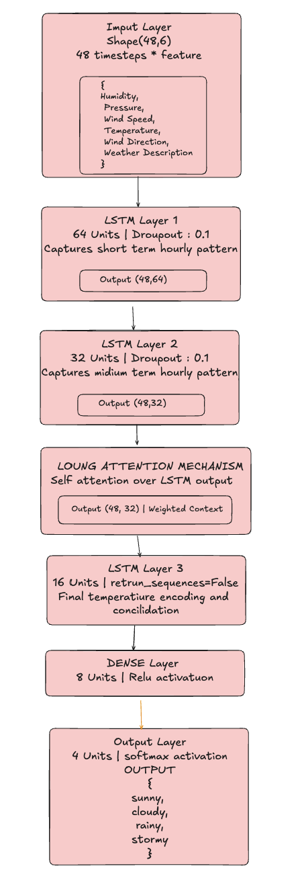

# Assignemn 2 : Predicting the weather category

## [Repository Link](https://github.com/C-gyeltshen/DAM202-Assignment2.git)

## 1. Dataset collection

**Historical Hourly Weather Data 2012-2017** dataset contains ~5 years of high temporal resolution (hourly measurements) data of various weather attributes, such as temperature, humidity, air pressure, etc.
The dataset is sourced from [Kaggle](https://www.kaggle.com/datasets/selfishgene/historical-hourly-weather-data).

We have **multi-file time-series dataset** with following data of 37 States

- temperature.csv (45253, 37)

- humidity.csv (45253, 37)

- pressure.csv (45253, 37)

- wind_speed.csv (45253, 37)

- wind_direction.csv (45253, 37)

- weather_description.csv (45253, 37)

- city_attributes.csv (37, 5)

city_attributes.csv contains metadata about each city, including its name, state, latitude, longitude, and elevation.

**Top 10 data rows in `city_attributes.csv` are as follows:**

| **Index** | **City**          | **Country**       | **Latitude**  | **Longitude**   |
| ----- | ------------- | ------------- | --------- | ----------- |
| `0`     | `Vancouver`     | `Canada`        | `49.249660` | `-123.119339` |
| 1     | Portland      | United States | 45.523449 | -122.676208 |
| 2     | San Francisco | United States | 37.774929 | -122.419418 |
| 3     | Seattle       | United States | 47.606209 | -122.332069 |

## 2. Data Creation

We will create a specific weather data for `Vancouver city` by extracting the relevant columns from the multi-file dataset.

After extracting all the relevent column for Vancouver city, the final dataset will have following columns:
1. humidity
2. pressure
3. temperature
4. wind_direction
5. wind_speed
6. weather_description

and the final dataset will have `45253` rows and `6` columns.

## 3. About the extracted dataset

The extracted dataset contains historical hourly weather data for Vancouver city from 2012 to 2017. It includes six key weather attributes: humidity, pressure, temperature, wind direction, wind speed, and weather description.

### 3.1 Dataset Overview
* **Shape:** **45,253** rows and **6** columns.
* **Purpose:** Contains various weather measurements for Vancouver.

### 3.2 Columns and Data Types
| Column Name | Data Type | Description |
| :--- | :--- | :--- |
| **humidity** | float64 | Relative humidity |
| **weather\_description** | object | Text description of the weather |
| **pressure** | float64 | Atmospheric pressure |
| **wind\_speed** | float64 | Wind speed |
| **temperature** | float64 | Temperature (likely in Kelvin, based on values) |
| **wind\_direction** | float64 | Wind direction |

### 3.3 Key Data Insights
* **Missing Values:** All columns have missing values. **`pressure`** has the most significant number of **4,234** missing entries, followed by **`humidity`** ($\approx 1,800$).
* **Initial Rows:** The first row contains **`NaN`** across all numerical columns, suggesting an initial data cleaning step may be required.
* **Temperature Range:** Temperatures range from **245.15 K** (min) to **307.0 K** (max). The mean is **283.86 K** ($\approx 10.7^\circ C$).
* **Humidity:** The mean humidity is high at **81.9%**.

## 4. Data Preprocessing

### Step 1: Handle Missing Values
**What**: Fill or remove empty values in the dataset

**How**:
- Replace missing numbers with the median value
- Replace missing text with the most common value

**Why Important**:
- Machine learning models cannot work with missing data
- Ensures complete dataset for analysis

---

### Step 2: Remove Duplicates
**What**: Delete identical duplicate rows

**How**:
- Check for rows that are exactly the same
- Keep only one copy of each duplicate

**Why Important**:
- Duplicate data skews analysis and model results
- Ensures accurate statistics and predictions

---

### Step 3: Remove Outliers
**What**: Identify and remove extreme/unusual values

**How**:
- Use IQR (Interquartile Range) method
- Remove values that are too high or too low

**Why Important**:
- Outliers can distort analysis and mislead models
- Makes data more representative of normal conditions

---

### Step 4: Convert Units
**What**: Change temperature from Kelvin to Celsius

**How**:
- Apply formula: Celsius = Kelvin - 273.15

**Why Important**:
- Makes data easier to understand and interpret
- Celsius is more commonly used than Kelvin

---

### Step 5: Encode Categorical Data
**What**: Convert text values to numbers

**How**:
- Convert weather descriptions (e.g., "rain", "sunny") to numbers (0, 1, 2...)

**Why Important**:
- Machine learning models only work with numbers
- Allows categorical data to be used in analysis

---

### Step 6: Standardize Numerical Features
**What**: Scale all numbers to have the same range

**How**:
- Transform values so mean = 0 and standard deviation = 1

**Why Important**:
- Different features have different ranges (humidity: 0-100, temperature: -50-50)
- Standardization ensures fair comparison and improves model performance
- Required for many machine learning algorithms

---

### Step 7: Create New Features
**What**: Generate new columns based on existing data

**How**:
- Create wind speed categories: Calm, Light, Moderate, Strong
- Create temperature categories: Cold, Cool, Warm, Hot

**Why Important**:
- New features can reveal patterns and relationships
- Helps machine learning models make better predictions
- Captures non-linear patterns in data

---

### Step 8: Final Validation
**What**: Check that all preprocessing is complete

**How**:
- Verify no missing values remain
- Check data types are correct
- Confirm no duplicates exist

**Why Important**:
- Ensures data is clean and ready for analysis
- Prevents errors in future modeling steps

---

### Summary Table

| Step | Action | Purpose |
|------|--------|---------|
| 1 | Fill missing values | Complete dataset |
| 2 | Remove duplicates | Remove redundant data |
| 3 | Remove outliers | Clean extreme values |
| 4 | Unit conversion | Improve interpretability |
| 5 | Encode categories | Convert text to numbers |
| 6 | Standardize features | Scale to same range |
| 7 | Feature engineering | Create new meaningful columns |
| 8 | Validation | Ensure data quality |

---

## 5. Architecture Diagram

